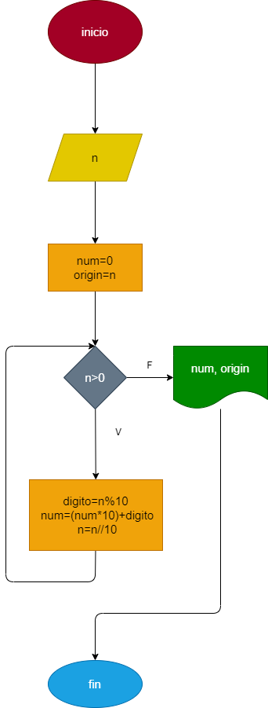

# Inverso_numero_repetitivo

# Hacer el diagrama de flujo y programa en python que lea un entero positivo de cualquier cantidad de cifras, que calcule su inverso y lo imprima junto con el original 

## Diagrama de flujo 